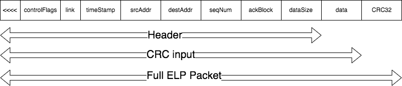

# expanding-link-protocol
Source, documentation and examples of ELP packet handlers in multiple programming languages.

# Why?
Packet frames are a useful means of moving data through a network. This library attempts to offer a packet composer/parser compatable with itself across several languages without the development overhead of related solutions such as (Protocol Buffers)[https://developers.google.com/protocol-buffers/].

This library offers a working packetizer & parser 'off the shelf' useful for applications build across heterogenous runtimes such as occur when linking sensor networks to cloud technologies.

# Packet Structure

<table>
  <tr>
    <td>Frame Leader*</td>
    <td>Control Flags*</td>
    <td>Source</td>
    <td>Destination</td>
    <td>Seq Num</td>
    <td>Ack Block</td>
    <td>Data Length</td>
    <td>Data</td>
    <td>CRC</td>
  </tr>
  <tr>
    <td>4</td>
    <td>2</td>
    <td>2</td>
    <td>2</td>
    <td>2</td>
    <td>4</td>
    <td>2</td>
    <td>Variable</td>
    <td>4</td>
  </tr>

  <tr>
    <td>"<<<<"</td>
    <td colspan="7">CRC Content</td>
    <td>CRC</td>
  </tr>
  <tr>
    <td></td>
    <td colspan="8" align="center">ELP Packet</td>
  </tr>
  <tr>
    <td colspan="9" align="center">ELP Frame</td>
  </tr>
</table>

<!--  -->

Packet frames are delimited by four 0x3C ('<') characters. Frames will have 0xC3 bytes inserted into the byte sequence after three '<' occur in sequence a packet.

The controlFlags field is a set of bit flags that indicate the presence of header fields. The shortest valid packet is 6 bytes: 4 '<' and 2 null (zero) bytes; the 'empty' packet can be used to keep links alive when no data is available.

There are 11 bits available in the Control Flags field. The remaining bits are used to calculate Hamming bits for forward error correction (helpful on links with poor connectivity or high bit errors rates). The implementations make some attempt to parameterize the fields defined by this protocol.
