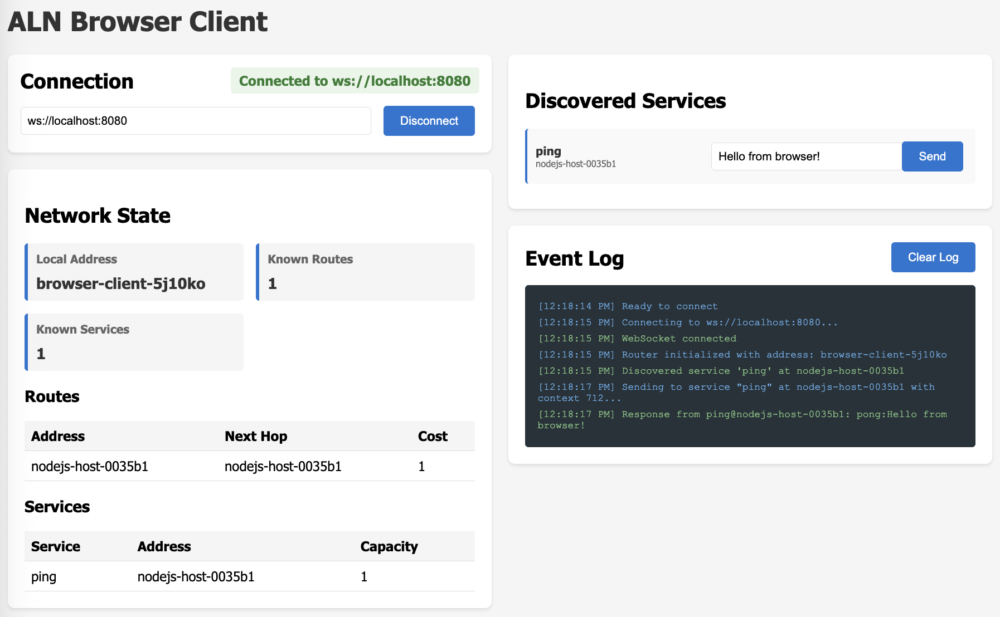

# aln-browser

Application Layer Network protocol implementation for web browsers - Zero-dependency mesh networking over WebSocket.

[](https://www.npmjs.com/package/aln-browser)
[](https://opensource.org/licenses/MIT)

**Zero dependencies** • **ES6 modules** • **JSON framing** • **WebSocket-only**

## Features

- 🌐 **Browser-native** - No Node.js dependencies, runs purely in the browser
- 📦 **Zero dependencies** - Lightweight and fast
- 🔌 **Service Discovery** - Automatic advertisement and discovery of network services
- 🚀 **Mesh Networking** - Multi-hop routing across the ALN network
- ⚖️ **Load Balancing** - Service selection based on capacity metrics
- 🎯 **Request/Response** - Context-based message correlation
- 📡 **Service Multicast** - Broadcast to all service instances

## Installation

### NPM/Bundlers (Vite, Webpack, etc.)

```bash
npm install aln-browser
```

```javascript
import { Router } from 'aln-browser'
import { WebSocketChannel } from 'aln-browser/wschannel'
```

### CDN (unpkg)

```html
<script src="https://unpkg.com/aln-browser/dist/aln-browser.min.js"></script>
<script>
  const router = new ALN.Router('my-node')
  // All exports available under ALN namespace
</script>
```

### ES Module from CDN

```html
<script type="module">
  import { Router } from 'https://unpkg.com/aln-browser/dist/aln-browser.esm.js'
  const router = new Router('my-node')
</script>
```

## Quick Start

```javascript
import { Router } from 'aln-browser'
import { WebSocketChannel } from 'aln-browser/wschannel'
import { Packet } from 'aln-browser/packet'

// Create router with unique address
const address = 'browser-' + Math.random().toString(36).slice(2, 8)
const router = new Router(address)

// Connect to ALN WebSocket server
const ws = new WebSocket('ws://localhost:8080')

ws.onopen = () => {
  const channel = new WebSocketChannel(ws)
  router.addChannel(channel)
  console.log('Connected to ALN network')
}

// Register a service
router.registerService('ping', (packet) => {
  console.log('Received ping:', packet.data)

  const response = new Packet()
  response.dst = packet.src
  response.ctx = packet.ctx
  response.data = 'pong: ' + packet.data
  router.send(response)
})

// Send a request
const ctxID = router.registerContextHandler((response) => {
  console.log('Got response:', response.data)
  router.releaseContext(ctxID)
})

const request = new Packet()
request.srv = 'ping'
request.ctx = ctxID
request.data = 'Hello!'
router.send(request)
```

## API Reference

### Router

**Constructor:**
```javascript
const router = new Router(address)
```
- `address` (string): Unique identifier for this router node

**Methods:**

#### `addChannel(channel)`
Attach a WebSocket channel to the router.

#### `send(packet)`
Send a packet through the network.
- Returns: `null` on success, error string on failure

#### `registerService(serviceID, handler)`
Register a service handler for incoming requests.
- `serviceID` (string): Service name
- `handler` (function): Callback `(packet) => {}`

#### `unregisterService(serviceID)`
Remove a service handler.

#### `registerContextHandler(handler)`
Register a response handler for request/response pattern.
- Returns: `contextID` (number) to use in outgoing request

#### `releaseContext(contextID)`
Free memory associated with a context handler.

#### `setOnServiceCapacityChanged(callback)`
Register callback for service capacity changes.
- `callback` signature: `(serviceID, capacity, address) => {}`

### Packet

**Constructor:**
```javascript
const packet = new Packet()
```

**Properties:**
- `src` (string): Source address (auto-filled by router)
- `dst` (string): Destination address (optional if `srv` is set)
- `srv` (string): Service name
- `ctx` (number): Context ID for request/response
- `data` (string): Packet payload
- `net` (number): Network state type (internal use)
- `seq`, `ack`, `typ`: Optional fields

**Methods:**
- `toJson()`: Serialize to JSON string
- `copy()`: Create a deep copy

### WebSocketChannel

```javascript
import { WebSocketChannel } from 'aln-browser/wschannel'

const ws = new WebSocket('ws://localhost:8080')
const channel = new WebSocketChannel(ws)
router.addChannel(channel)
```

**Methods:**
- `send(packet)`: Send a packet through the WebSocket
- `close()`: Close the WebSocket connection

## Examples

### Service Discovery

```javascript
import { Router } from 'aln-browser'
import { Packet } from 'aln-browser/packet'

const router = new Router('service-node')

// Register a service
router.registerService('echo', (packet) => {
  const response = new Packet()
  response.dst = packet.src
  response.ctx = packet.ctx
  response.data = packet.data // Echo back
  router.send(response)
})

// Service discovery happens automatically when channels connect
```

### Service Multicast

```javascript
const packet = new Packet()
packet.srv = 'log' // Target all 'log' services
// Don't set packet.dst - multicast requires empty destination
packet.data = 'Broadcast message'
router.send(packet)
// All instances of 'log' service will receive this
```

### Monitoring Service Capacity

```javascript
router.setOnServiceCapacityChanged((serviceID, capacity, address) => {
  console.log(`Service ${serviceID} at ${address} has capacity ${capacity}`)
})
```

## Running the Demo

The package includes an interactive browser demo:

```bash
# Clone the repository
git clone https://github.com/chadbohannan/application-layer-network.git
cd application-layer-network/aln-browser

# Start HTTP server (required for ES6 modules)
npm run serve

# In another terminal, start an ALN WebSocket server
cd ../aln-nodejs/examples
npm install
npm run server
```

Open http://localhost:8000/examples/ping-client.html



**Note:** Files must be served over HTTP, not opened directly (`file://` protocol doesn't support ES6 modules).

## Architecture

- **WebSocket Only**: Browser environment limitation (no TCP/Serial support)
- **JSON Framing**: WebSocket provides message boundaries, no KISS encoding needed
- **Native APIs**: Uses TextEncoder, DataView, atob/btoa for binary handling
- **Service Discovery**: Automatic advertisement and routing
- **Distance Vector Routing**: Multi-hop packet routing with cost metrics
- **Load Balancing**: Routes to service instances based on capacity

## Building

The package includes both raw ES modules and pre-built bundles:

```bash
npm install
npm run build
```

This creates:
- `dist/aln-browser.min.js` - IIFE bundle for `<script>` tags
- `dist/aln-browser.esm.js` - ESM bundle for modern bundlers
- Source maps for debugging

## Testing

```bash
# Run tests
npm test

# Run tests in watch mode
npm run test:watch
```

## Browser Compatibility

**Requires:**
- WebSocket API
- ES6 modules (`import`/`export`)
- TextEncoder/TextDecoder
- Modern JavaScript (ES2020+)

**Works on:**
- Chrome 90+
- Firefox 88+
- Safari 14+
- Edge 90+

## Protocol

See [ALN_PROTOCOL.md](https://github.com/chadbohannan/application-layer-network/blob/master/ALN_PROTOCOL.md) for complete protocol specification.

## Related Projects

- **aln-nodejs**: Node.js implementation with TCP and WebSocket support
- **aln-python**: Python implementation
- **aln-go**: Go implementation

## Security Considerations

**Development:**
- WebSocket servers typically allow all origins for testing

**Production:**
- Validate WebSocket origin headers on the server
- Use WSS (secure WebSocket) when serving over HTTPS
- Restrict connections to trusted domains
- Implement authentication/authorization in your services

## License

MIT - See LICENSE file for details

## Author

Chad Bohannan

## Contributing

Issues and pull requests welcome at https://github.com/chadbohannan/application-layer-network
