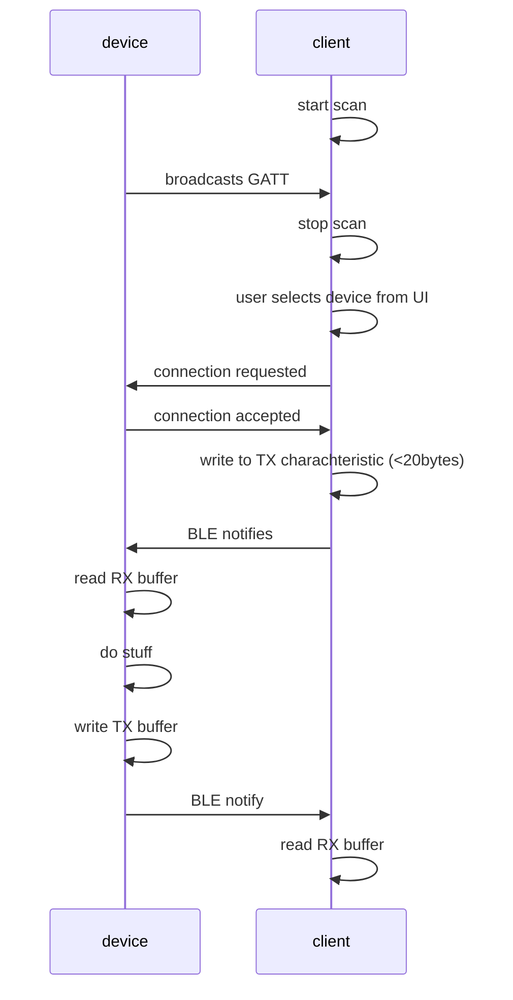

Build and upload to ESP32 with Arduino IDe

Use mobile app to interact with devices.

IOS: https://apps.apple.com/at/app/adafruit-bluefruit-le-connect/id830125974

Android: https://play.google.com/store/search?q=bluefruit+connect&c=apps&hl=en_US&gl=US

